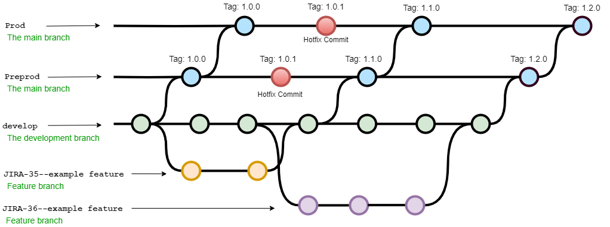

# !ATTENTION!
Currently the development branch is the latest source of truth.  
Deployments to field are done from master branch, see below.  
Current version: 1.2.2  

# Background #
The purpose of this product - GSB Forward proxy is to establish connection to group service bus gateway in Volkswagen Intranet.  

# Usage Instructions #
Project Structure in Bitbucket:  
- Autoscaling
- LoadBalancer
- TFVARS

**Pre-requisite :** TFVARS/*/variables.tfvars  has to be configured for deployment environment  
**Step 1:** Configuration changes for deployment if needed to be configured in variables.tfvars  
**Step 2:** GSB deployment is automated with CI tool. Concourse is chosen CI tool, login to team
connection-integration for deployment.  
**Step 3:** Trigger the build for gsb,  job execute infrastructure deployment on AWS using terraform
scripts.  

# Contributing and Branching #
## Branches ##
**develop:** Main branch to use.  
**Prod:** production branch.  
**Preprod:** Preproduction branch.  
**hotfix:** branch is always created from Prod and merged to Prod to solve an urgent problem in production/live.   
**feature:** branch is used for feature development, is always created from develop and merged to develop.   
**bugfix:** branch is used for non-urgent fixes, is always created from develop and merged to develop.   

## Contributing ##
When contributing to this repository, please first discuss the change you wish to make via issue,
email, or any other method with the owners of this repository before making a change. 

## Creating a JIRA ticket ##
If you'd like to contribute please create at first a JIRA ticket at https://devstack.vwgroup.com/jira/projects/GSBPROXY/ if not already done. 

## Creating a Branch
Please use the JIRA "Create branch" feature for this purpose. Please avoid creating branches manually. 
Concerning branches the GIT-Flow workflow shall be applied to this GIT repository. 

For branching the GIT-Flow model is applied:

## Pull Request Process

1. Ensure any install or build dependencies are removed before the end of the layer when doing a 
   build.
2. If needed and helpful for others, update the README.md with details of changes to the interface, 
   this includes new environment variables, useful file locations and container parameters.
3. Versioning is not applied to files. We use tags for this purpose. Tags carying a version shall be 
   according to [SemVer](http://semver.org/) unless we are bound to a fixed global version tag or 
   use a tag for another purpose like indicating the SC-3 to be rolled out.
4. You may merge the Pull Request in once you have the sign-off of at least one other developers.

## Naming and Coding Conventions
Please follow naming and coding guidelines/conventions. Definitions on platform level overule AWS recommendations. 

### Vault, Concourse, Kubernetes (K8S)
Conventions are defined [here](https://devstack.vwgroup.com/confluence/display/DEVICEPLAT/Policies+and+Naming+conventions).

### AWS Resources 
AWS naming guidelines are defined [here](https://docs.aws.amazon.com/whitepapers/latest/tagging-best-practices/best-practices-for-naming-tags-and-resources.html). 
For tagging of AWS resources the [GITC tagging strategy](https://devstack.vwgroup.com/confluence/display/DEVICEPLAT/MBB+-+AWS+Tagging+Strategy) has to be met. 

Code conventions (also infrastrucutre / pipeline code) [are defined on platform level](https://devstack.vwgroup.com/confluence/display/DEVICEPLAT/Code+Management). 
 * Concourse: https://devstack.vwgroup.com/confluence/display/DEVICEPLAT/WIP+Concourse+Pipeline
 * Python: https://devstack.vwgroup.com/confluence/display/DEVICEPLAT/WIP+Python
 * Terraforming: https://devstack.vwgroup.com/confluence/display/DEVICEPLAT/WIP+Terraform

Lookups
Use Lookups instead of hardcoded values (e.g. VPCs, subnets, security groups, https resources, etc.)

# Documentation #
## GSB connectivity to AWS ##
https://devstack.vwgroup.com/confluence/pages/viewpage.action?pageId=8832899&src=contextnavpagetreemode
Note:  
Approach 2 is followed and to be focused.  

## Runbook link - GSB-Proxy ##
https://devstack.vwgroup.com/confluence/display/DEVICEPLAT/Rollout%3A+GSB+Proxy?src=contextnavpagetreemode

## Lessons Learned page ##
https://devstack.vwgroup.com/confluence/display/DEVICEPLAT/AWS+Ireland%3A+Lessons+Learned

## CI Q&A ##
https://devstack.vwgroup.com/confluence/display/DEVICEPLAT/Test+Documents?src=contextnavpagetreemode

## Usefull links ##
#### DTP Landing Page ####
https://devstack.vwgroup.com/confluence/display/DEVICEPLAT/Landing+Page
#### Developer Startup information ####
https://devstack.vwgroup.com/confluence/display/DEVICEPLAT/Developer+Startup+Information
#### Known Error Records ####
https://devstack.vwgroup.com/confluence/display/DEVICEPLAT/Known+Error+Records+-+GSB+Proxy
#### MBB tenant concept ####
https://devstack.vwgroup.com/confluence/display/DEVICEPLAT/GSB+Proxy+MBB-Tenant-Concept
#### MBB + AWS Tagging Strategy ####
https://devstack.vwgroup.com/confluence/display/DEVICEPLAT/MBB+-+AWS+Tagging+Strategy

## Contributors ##
Volkswagen - Connection & Integration Stream  
Reply  
Volkswagen Group Services Slovakia  

## Owner Email ##
martin.wuschke@volkswagen.de  

## License ##
Volkswagen AG 

## Attribution

This Code of Conduct is adapted from the [Contributor Covenant][homepage], version 1.4,
available at [http://contributor-covenant.org/version/1/4][version]

[homepage]: http://contributor-covenant.org
[version]: http://contributor-covenant.org/version/1/4/
